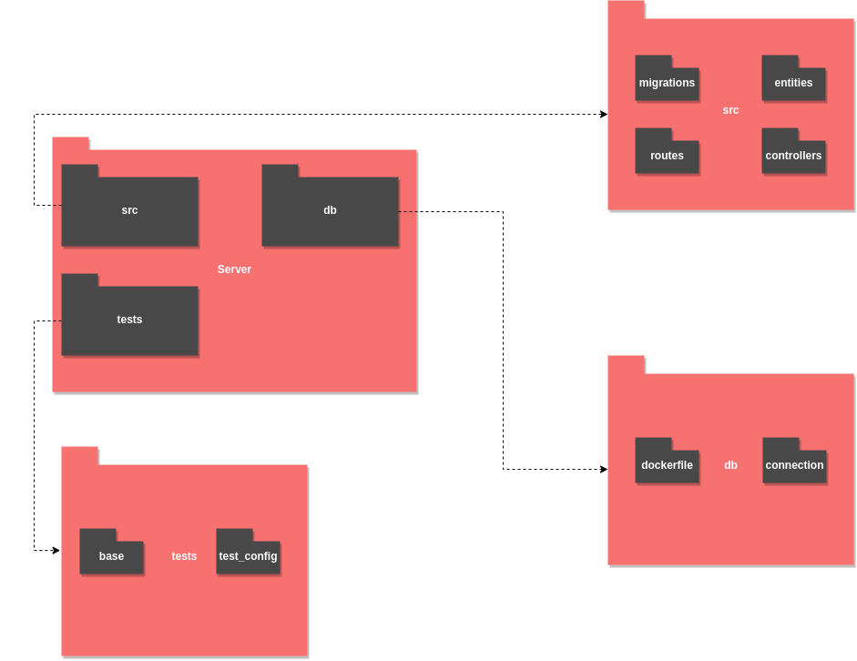

# Documento de Arquitetura de Software

## Histórico de Revisão
| Data| Versão | Descrição | Autor |
|--|--|--|--|
| 03/mar/2021 | 0.1| Tópicos 1.1, 1.2, 1.3 e 1.4 | Brian Pina e Arthur Matos |
| 03/mar/2021 | 0.2 | Tópicos 2.1 | Brian Pina, Arthur Matos e Gabriel Sabanai |
| 03/mar/2021 | 0.3 | Tópicos 3, 4.1 | Brian Pina, Arthur Matos e Gabriel Sabanai |
| 05/mar/2021 | 0.4 | Tópicos 3, 4.2 | Brian Pina, Arthur Matos, Gabriel Sabanai e Saleh Kader |
 | |

## 1. Introdução

### 1.1 Finalidade

Este documento oferece uma visão geral arquitetural abrangente do sistema, usando diversas visões arquiteturais para representar os diferentes aspectos do sistema. O objetivo deste documento é capturar e comunicar as decisões arquiteturais significativas que foram tomadas em relação ao sistema.

### 1.2 Escopo

O Eccoar é um Progressive Web App (PWA)  que tem por objetivo ser a voz do cidadão em comunicar para as instituições governamentais sobre problemas em suas cidades.

Esse documento tem como objetivo representar as decisões arquiteturais do Eccoar, levando em conta as restrições impostas devido o contexto e visão da aplicação. Estão descritos neste documento especificações de tecnologia como linguagens, frameworks e padrões de projeto.

### 1.3 Definições, Acrônimos e Abreviações

* API: Application Programming Interface ou Interface de Programação de Aplicações é conjunto de definições e protocolos usado no desenvolvimento e na integração de software de aplicações.
* API Gateway: O gateway de API é uma ferramenta de gerenciamento de APIs que fica entre o cliente e uma coleção de serviços de back-end.
* PWA: Progressive Web Apps são aplicações desenvolvidas para web que dão acesso a funcionalidades nativas, tendo como três pilares instabilidade, confiabilidade e capacidade.

### 1.4 Referências
"On the Criteria To Be Used in Decomposing Systems into Modules" do D.L. Parnas;

[https://fga-eps-mds.github.io/2018.2-Kalkuli/docs/docArquitetura](https://fga-eps-mds.github.io/2018.2-Kalkuli/docs/docArquitetura)

[https://cjjcastro.gitlab.io/2019-1-hubcare-docs/project/architecture-document/](https://cjjcastro.gitlab.io/2019-1-hubcare-docs/project/architecture-document/)

[https://www.redhat.com/pt-br/topics/api/what-are-application-programming-interfaces](https://www.redhat.com/pt-br/topics/api/what-are-application-programming-interfaces)

[https://www.redhat.com/pt-br/topics/api/what-does-an-api-gateway-do](https://www.redhat.com/pt-br/topics/api/what-does-an-api-gateway-do)

[https://reactjs.org/tutorial/tutorial.html#what-is-react](https://reactjs.org/tutorial/tutorial.html#what-is-react)

[https://web.dev/what-are-pwas/](https://web.dev/what-are-pwas/)

[https://www.thoughtworks.com/pt/insights/blog/architecting-continuous-delivery](https://www.thoughtworks.com/pt/insights/blog/architecting-continuous-delivery)

[https://engsoftmoderna.info/cap7.html](https://engsoftmoderna.info/cap7.html)

[https://martinfowler.com/architecture/](https://martinfowler.com/architecture/)

[https://martinfowler.com/bliki/MicroservicePrerequisites.html](https://martinfowler.com/bliki/MicroservicePrerequisites.html)

[https://martinfowler.com/articles/microservices.html](https://martinfowler.com/articles/microservices.html)

[http://highscalability.com/blog/2014/4/8/microservices-not-a-free-lunch.html](http://highscalability.com/blog/2014/4/8/microservices-not-a-free-lunch.html)

## 2. Representação Arquitetural

* **ReactJS**: React é uma biblioteca de JavaScript flexível, declarativa e eficiente para construção de interfaces para exibição ao usuário. O React permite a criação desde interfaces complexas até pequenos e isolados pedaços de código chamados “componentes”.

* **NodeJS**: NodeJS é um software de código aberto que executa códigos Javascript no backend/servidor e no frontend. É baseado no interpretador de Javascript em C++ V8.

* **Typescript**: Typescript é um superconjunto de Javascript que insere na linguagem conceitos como tipagem estática, forte e inferida.

* **Redis**: Redis é um banco de dados em memória altamente performático com funciona com base em estruturas de chave-valor.

* **Microsserviços**: É uma abordagem arquitetônica e organizacional do desenvolvimento de software na qual consiste em pequenos serviços independentes, como módulos, que se comunicam usando API’'s. Dessa forma, os microsserviços facilitam a escalabilidade do software. Os microsserviços usados nesta aplicação são: 

    - **Módulo de Usuário**: Módulo responsável pelo registro e gerenciamento de usuários da aplicação;

    -  **Módulo de Denúncias**: Módulo responsável por relatar e armazenar as denúncias relacionadas aos posts dentro da aplicação ;

    - **Módulo de Email**: Módulo responsável pelo envio de email para as instituições governamentais;

    - **Módulo de Report**: Módulo responsável por gerar os relatórios das denúncias;

    - **Gateway**: Ponte entre a interação da interface do usuário com os microsserviços do back-end;

    - **Front-end**: Tela de interface do usuário por onde o mesmo vai interagir com a aplicação;

* **Service Worker**: Os services workers são extremamente importantes para a criação de PWA’s. Ele é um script no navegador que roda separado da página web, possibilitando recursos que não precisam da interação do usuário. Na prática ele é um script em javascript que controla a página do site na qual ele é associado.

* **Sass**: O Sass é uma linguagem de folha de estilo compilada para CSS, adicionando poder para a linguagem. Com o Sass é possível utilizar variáveis, regras de alinhamento, mixins, funções e várias outras funcionalidades.

## 3. Metas e Restrições da Arquitetura

São metas da arquitetura:

* Facilitação no processo de desenvolvimento.

* Acessibilidade para a maior parte da população.

* Independência no desenvolvimento das equipes.

* Alta mutabilidade em seus serviços.

* Clareza no desenvolvimento dos serviços.

São restrições da arquitetura:

* A aplicação deverá se comportar como um Progressive Web App;

* A aplicação necessita de ser executada nos navegadores Google Chrome, Mozilla Firefox e Safari;

## 4. Visão Lógica 

### 4.1 Visão Geral

A aplicação é baseada na arquitetura de microsserviços, com o intuito de facilitar o desenvolvimento como a escalabilidade do software. Dessa forma, cada microsserviço vai ser responsável por executar uma tarefa, uma requisição ou um processamento de dados, resultando assim, em uma implementação mais rápida com facilidade na sua manutenção.

### 4.2 Pacotes de Design Significativos do Ponto de Vista da Arquitetura

