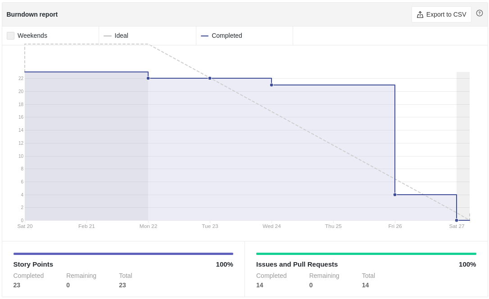
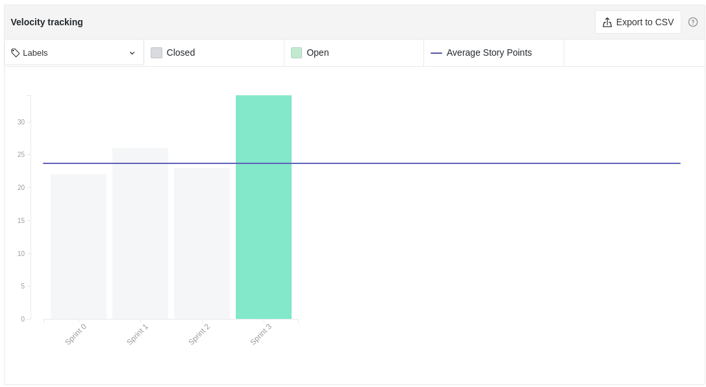
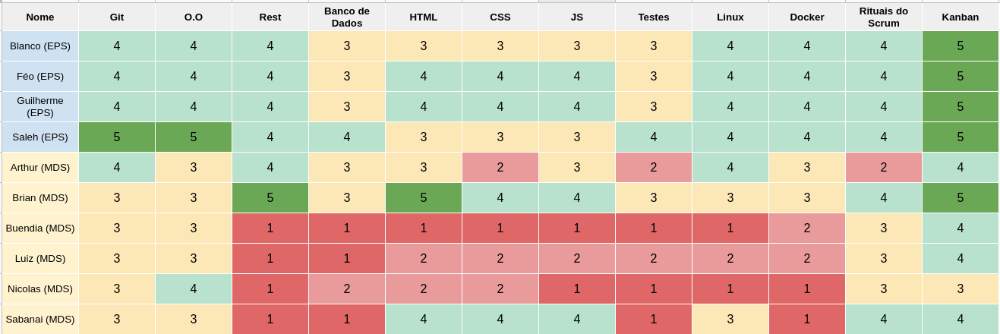
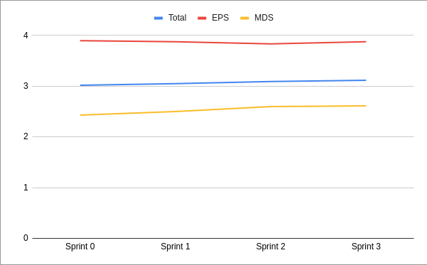
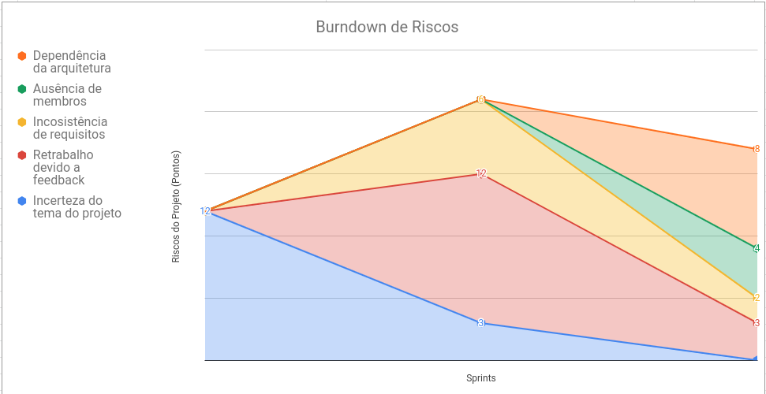
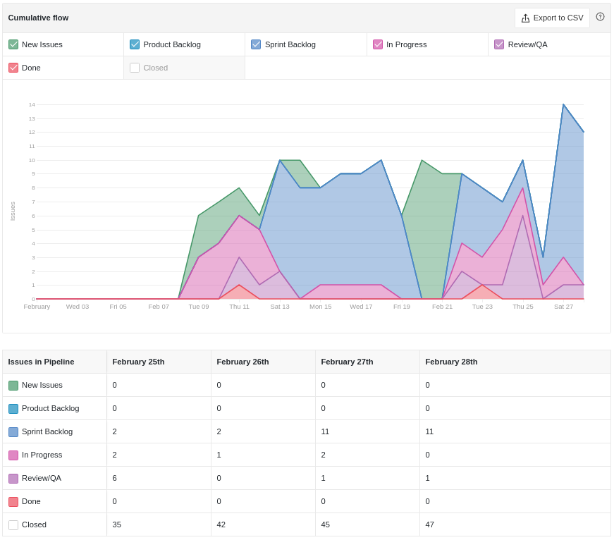
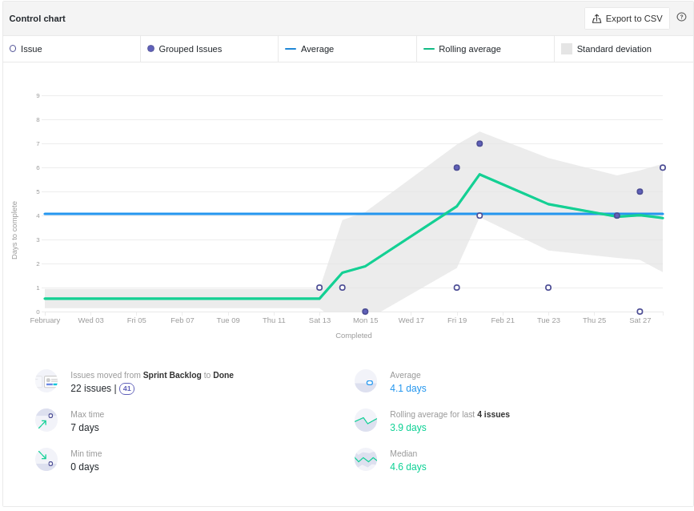
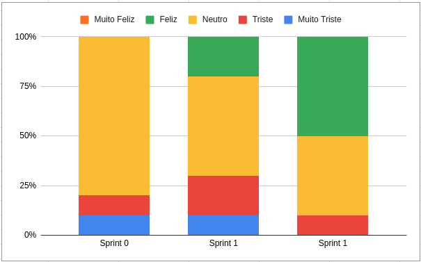

# Review da Sprint 2

## Histórico de revisão
|Autor|Mudanças|Data|Versão|
|--|--|--|--|
|[Pedro Féo](https://github.com/phe0)|Criação do documento|28/02/2021|1.0|

## Avaliação do Scrum Master

 - O Burndown continua sem ser o idela, porém nessa sprint conseguimos ver que o problema talvez não seja a falta de trabalho no começo da sprint, pois atividades de poucos pontos foram fechadas nesse período. Isso indica que o time como um todo está priorizando realizar atividades menores primeiro.
 - Tinhamos planejado uma sprint com menos pontos, porém o time continuou a relatar falta de organização pessoal e tempo para realizar as atividades.
 - O nível de conhecimento do grupo está aumentando lentamente, os EPS estão estudando mais sobre seus papeís e os MDS estão aprendendo ferramentas novas no decorrer das sprints, estão também relatando estar ficando mais confiantes com a parte técnica.
 - Todos os riscos relatados anteriormente foram anulados ou diminuíram bastante, porém dois novos riscos apareceram. Um dos membros irá viajar para a casa da família durante a sprint, podendo não conseguir trabalhar muito na disciplina. Outro risco é a dependência de decisões arquiteturais para se iniciar a implementação do projeto.
 - Pelo cycle time, é possível ver que o tempo médio de conclusão das issues diminuiu bastante, isso mostra que o time está criando o hábito de revisar atividades mais frequentemente.
 - A sprint foi a que mostrou melhor humor dos membros até agora, muios ficaram animados após a conversa com o professor Hilmer, além de estarem animados por estar chegando cada vez mais perto de mexer com código.

## Reports

### Tarefas Realizadas

|Tarefa|Responsáveis|Pontuação|Concluída|
|--|--|--|--|
|[Documentação Planning Sprint 2](https://github.com/fga-eps-mds/EPS-2020-2-G2/issues/39)|[Matheus Blanco](https://github.com/MatheusBlanco)|1|✔|
|[Documentação Review Sprint 1](https://github.com/fga-eps-mds/EPS-2020-2-G2/issues/40)|[Pedro Féo](https://github.com/phe0)|1|✔|
|[Aplicar treinamento de docker](https://github.com/fga-eps-mds/EPS-2020-2-G2/issues/38)|[Guilherme Marques](https://github.com/guilhesme23)|1|✔|
|[Requisitos de Questionário](https://github.com/fga-eps-mds/EPS-2020-2-G2/issues/37)|[Nicolas Chagas](https://github.com/nszchagas)|2|✔|
|[Requisitos de benchmarking](https://github.com/fga-eps-mds/EPS-2020-2-G2/issues/36)|[Luiz Henrique](https://github.com/luiz-herique) e [Guilherme Marques](https://github.com/guilhesme23)|2|✔|
|[Finalizar Lean Inception](https://github.com/fga-eps-mds/EPS-2020-2-G2/issues/35)|[Arthur Matos](https://github.com/Arthur-Matos), [Gabriel Sabanai](https://github.com/Sabanai104), [Saleh Kader](https://github.com/devsalula)|5|✔|
|[Documento de Visão](https://github.com/fga-eps-mds/EPS-2020-2-G2/issues/34)|[Brian Pina](https://github.com/DLBrianPina), [Matheus Blanco](https://github.com/MatheusBlanco)|5|✔|
|[Termo de abertura de projeto](https://github.com/fga-eps-mds/EPS-2020-2-G2/issues/18)|[Victor Buendia](https://github.com/Victor-Buendia) e [Pedro Féo](https://github.com/phe0)|5|✔|
|[Aplicar o treinamento de Figma](https://github.com/fga-eps-mds/EPS-2020-2-G2/issues/17)|[Pedro Féo](https://github.com/phe0)|1|✔|

### Burndown

### Velocity

### Conhecimento dos membros

#### Quadro de Conhecimentos

#### Gráfico de Melhoria

### Riscos

### Cumulative flow

### Cycle time

### Gráfico de Humor
